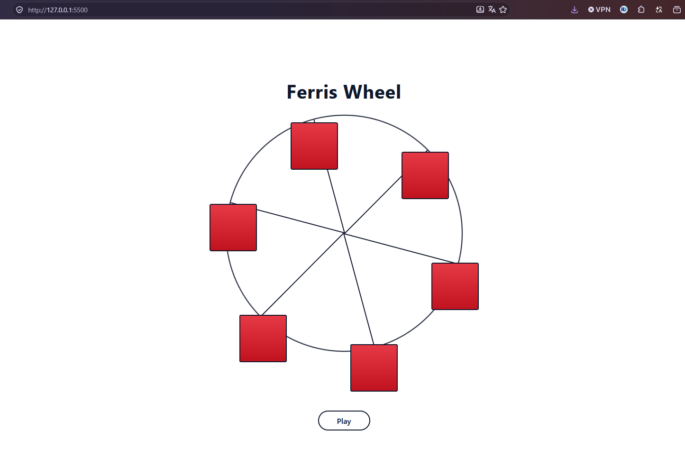

# Ferris Wheel

Une grande roue animée en CSS, avec un bouton pause en JavaScript et le respect du réglage « réduire les animations ».





## Ce que j'ai pratiqué

- **Animations CSS** : `@keyframes`, `animation`, `linear`, `infinite` et `animation-play-state` pour mettre en pause
- **Transformations** : `rotate()` et `transform-origin` ; les cabines tournent dans le sens inverse de la roue pour rester droites
- **Positionnement** : `position: relative` sur la roue, `position: absolute` sur les rayons et les cabines
- **Variables CSS** : `--angle`, `--wheel-duration` et `--color-*` pour éviter de répéter les mêmes valeurs
- **CSS Grid** : centrer la page avec `display: grid` et `place-items: center`
- **Accessibilité** : `role="img"` avec `aria-label`, texte réservé aux lecteurs d'écran (`.sr-only`), `prefers-reduced-motion` et `:focus-visible`
- **JavaScript** : écouter un clic et basculer une classe avec `classList.toggle`

## Technologies

- HTML5 sémantique
- CSS3 (variables, Grid, animations)
- JavaScript

## Installation locale

```bash
git clone https://github.com/DocariDR/ferris-wheel-freecodecamp.git
cd ferris-wheel-freecodecamp
```

Ouvre ensuite `index.html` dans ton navigateur. Aucune dépendance à installer.

## Structure du projet

```
ferris-wheel/
├── index.html
├── styles.css
├── script.js
├── screenshot.png
└── README.md
```

## Auteur

**Ricardo Dovonou (DocariDR)**

- [GitHub](https://github.com/DocariDR)
- [LinkedIn](https://linkedin.com/in/ricardo-dovonou)
- [Portfolio](https://portfolio-docaridr.vercel.app)
